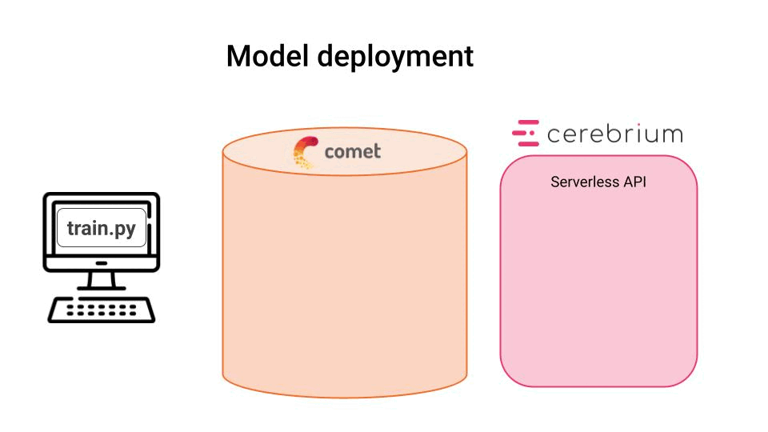

<div align="center">
    <a href='https://www.realworldml.net/'></a>
    <h1>Train and Deploy a Serverless API to predict crypto prices</h1>
    
</div>

<br>

<!-- <p align="center">
  
</p> -->

#### Contents
* [The problem](#the-problem)
* [This is what you will learn](#this-is-what-you-will-learn)
* [Tools](#tools)
* [Run the whole thing in 5 minutes](#run-the-whole-thing-in-5-minutes)
* [Part 1. Model training 🏋️](#1-model-training)
    * [Step 1. Create your virtual environment](./lectures/01_model_training.md#1-create-the-virtual-environment-with-poetry)
    * [Step 2. Generate training data](./lectures/01_model_training.md#2-generate-training-data)
    * [Step 3. Build a baseline model](./lectures/01_model_training.md#3-build-a-baseline-model)
    * [Step 4. Build Machine Learning models](./lectures/01_model_training.md#4-build-machine-learning-models)
* [Part 2. Model deployment as REST API 🚀](#2-model-deployment-as-rest-api)
    * [Step 5. Deploy the model as a Serverless REST API](./lectures/02_model_deployment.md#5-deploy-the-model-as-a-serverless-rest-api)
* [Part 3. Automation with GitHub actions and the Model Registry 🪝](#3-automatic-deployments-with-github-actions-and-model-registry-webhooks)
* [Wanna learn more real-time ML?](#wanna-learn-more-real-time-ml)

## The problem

Predicting crypto price movements is extremely hard. But it is also a great field to show what Machine Learning has to offer.

In this tutorial you won't build an ML system that will make you rich. But you will master the MLOps frameworks and tools you need to build ML systems that, together with tons of experimentation, can take you there.

With this hands-on tutorial, I want to help you grow as an ML engineer and go beyond notebooks.

<br>

## This is what you will learn

You will learn to
- **train** an ML model prototype through careful experimentation, using [CometML](https://www.comet.com/signup?utm_source=pau&utm_medium=partner&utm_content=github).
- **deploy** the model as a REST API, with [Cerebrium](https://www.cerebrium.ai?utm_source=pau&utm_medium=partner&utm_content=github).
- **automate** safe deployments, using GitHub actions and Comet ML Model Registry.

Without further ado, let's get to work!

<br>

## Tools
We will use a 100% Serverless stack, so you don't need to set up and maintain infrastructure

* [CometML](https://www.comet.com/signup?utm_source=pau&utm_medium=partner&utm_content=github) as experiment tracker and model registry
* [Cerebrium](https://www.cerebrium.ai?utm_source=pau&utm_medium=partner&utm_content=github) as a deployment platform
* [GitHub actions](https://github.com/features/actions) to automate workflows.

<br>

## Run the whole thing in 5 minutes

If you only have 5 minutes and want to see the whole system in action, follow these steps:

1. Create a Python virtual environment with all project dependencies with

    ```
    $ make init
    ```


2. Set your API keys for [Comet ML](https://www.comet.com/signup?utm_source=pau&utm_medium=partner&utm_content=github) and [Cerebrium](https://www.cerebrium.ai?utm_source=pau&utm_medium=partner&utm_content=github) in `set_environment_variables_template.sh`, rename the file as `set_environment_variables.sh` and run it
    ```
    $ . ./set_environment_variables.sh
    ```

3. Download historical data from Coinbase and save it locally to disk
    ```
    $ make data
    ```

4. Train ML model
    ```
    $ make train
    ```

5. Deploy the model
    ```
    $ make deploy
    ```

6. Take the endpoint URL you get from Cerebrium in the previous step, and set the `CEREBRIUM_ENDPOINT_URL` variable in `set_environment_variables.sh`. Then re-run
    ```
    $ . ./set_environment_variables.sh
    ```

7. Test the endpoint works
    ```
    $ make test-endpoint
    ```
<br>

## Lectures

### 1. Model training

In this first lecture you will

- fetch raw data
- transform it into features and targets
- build a baseline model
- experiment with several ML models in a fast and reliable way, using Python scripts and [Comet ML experiment tracking](https://www.comet.com/signup?utm_source=pau&utm_medium=partner&utm_content=github)

In this lecture you won't train an ML model that will make you rich. But you will master the framework and skillset you need if you want to build ML models that, together with tons of experimentation, can take you there.

Ready to get your hands-dirty? **[Start training models 👩‍💻👨🏽‍💻 🏋️](./lectures/01_model_training.md)**

<br>

### 2. Model deployment as REST API

In this second lecture you will

- deploy the best ML model you found in lecture 1 as a REST API using [Cerebrium](https://www.cerebrium.ai?utm_source=pau&utm_medium=partner&utm_content=github)

- test the endpoint works.

Ready to deploy? **[Start deploying models 👩‍💻👨🏽‍💻 🚀](./lectures/02_model_deployment.md)**

<br>

### 3. Automatic deployments with GitHub actions and Model Registry webhooks

ML models often need to be re-trained to keep them performant. Hence, automating safe deployments is a must.

In this third and final lecture you will

- build a continuous deployment pipeline using GitHub actions
- create a webhook to trigger deployments from the Model Registry.

Ready for the final round? **[Start automating safe deployments 👩‍💻👨🏽‍💻 🪝](./lectures/03_continuous_deployment_with_webhooks.md)**

<br>

## Wanna learn more Real-Time ML?

Wanna learn to build a complete ML system that

- ingests real-time crypto data
- trains predictive ML models, and
- continuously deploys them

using MLOps best practices?

I am preparing a new hands-on tutorial where you will learn all this.

**[Subscribe to The Real-World ML Newsletter](https://paulabartabajo.substack.com/)** to be notified when the tutorial is out.

<div align="center">
    <sub>Let's connect 🤗</sub>
    <br />
    <a href="https://twitter.com/paulabartabajo_">Twitter</a> •
    <a href="https://www.linkedin.com/in/pau-labarta-bajo-4432074b/">LinkedIn</a> •
    <a href="https://paulabartabajo.substack.com/">Newsletter</a>
<br />
</div>

<div align="center">
    <a href='https://www.realworldml.net/'></a>
</div>


