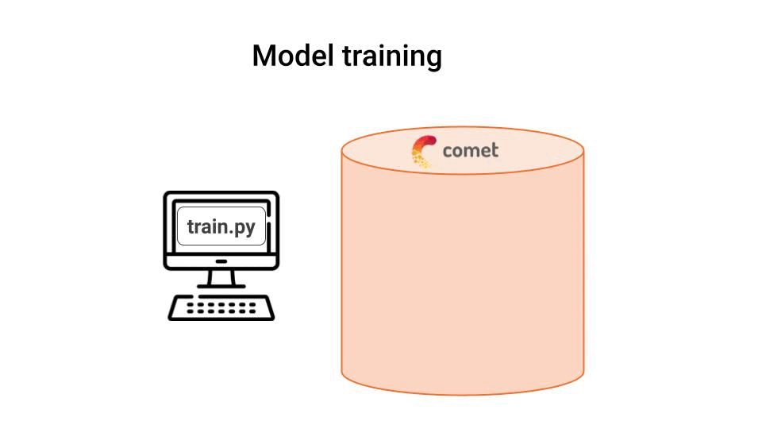
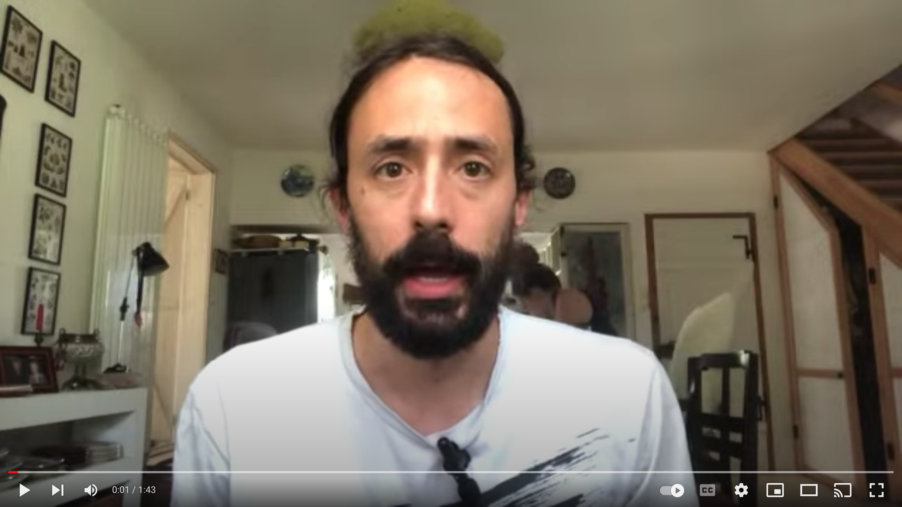
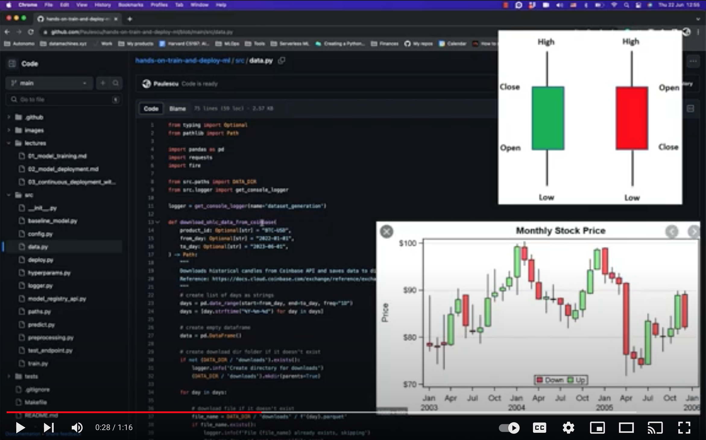
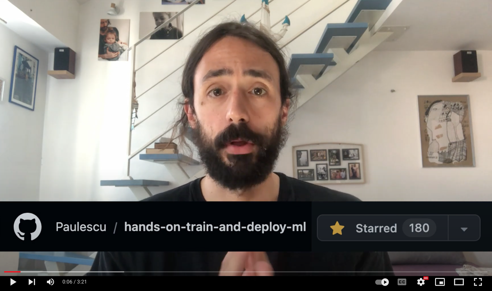
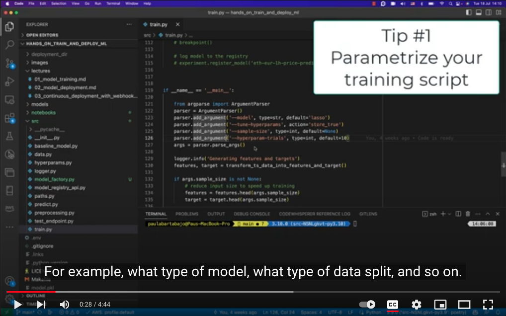

<div align="center">
    <h1>Lecture 1</h1>
    <h1>Model training and experimentation with <a href="https://www.comet.com/signup?utm_source=pau&utm_medium=partner&utm_content=github">Comet ML </a></h1>
</div>

<br />

<p align="center">
    <a href="https://www.comet.com/signup?utm_source=pau&utm_medium=partner&utm_content=github">
    
    </a>
</p>

#### Steps

1. [Create the virtual environment with Poetry](#1-create-the-virtual-environment-with-poetry)
2. [Generate training data](#2-generate-training-data)
3. [Build a baseline model](#3-build-a-baseline-model)
4. [Build Machine Learning models](#4-build-machine-learning-models)


## 1. Create the virtual environment with [Poetry](https://python-poetry.org/docs/)

<div align="center">
  <a href="https://www.youtube.com/watch?v=xLtP7zSJwvE">
      <p>Watch the video 🎬</p>
    
  </a>
</div>

<br>

1. Create a Python virtual environment with all project dependencies with
    ```
    $ curl -sSL https://install.python-poetry.org | python3 -
	$ poetry install
    ```
    or simply use the `Makefile`
    ```
    $ make init
    ```

2. Activate the virtual environment you just created
    ```
    $ poetry shell
    ```

3. [Sign up for Comet ML for FREE](https://www.comet.com/signup?utm_source=pau&utm_medium=partner&utm_content=github), create a workspace and copy your API key from the dashboard.

4. Set your API key and workspace name variables in `set_environment_variables_template.sh`, rename the file and run it
    ```
    $ . ./set_environment_variables.sh
    ```

Your local development environment is ready. Let's now generate some training data.

## 2. Generate training data

<div align="center">
  <a href="https://www.youtube.com/watch?v=u6dFm85hXK4">
    <p>Watch the video 🎬</p>
    
  </a>
</div>


Download historical data from Coinbase and save it locally to disk

- Run either `$ python src/data.py`, or
- Simply `$ make data`

## 3. Build a baseline model

<div align="center">
  <a href="https://www.youtube.com/watch?v=kOrmsVFlXkI">
    <p>Watch the video 🎬</p>
    
  </a>
</div>


- Establish a baseline performance using a very dummy (yet powerful) baseline model
    ```
    $ python src/baseline_model.py
    ```

## 4. Build Machine Learning models

<div align="center">
  <a href="https://www.youtube.com/watch?v=Sx7k0iDqy9I">
    <p>Watch the video 🎬</p>
    
  </a>
</div>

- Here is the list of experiments I ran
    ```
    $ python src/baseline_model.py
    $ python src/train.py --model lasso
    $ python src/train.py --model lasso --tune-hyperparams --hyperparam-trials 3
    $ python src/train.py --model lightgbm
    $ python src/train.py --model lightgbm --tune-hyperparams --hyperparam-trials 3
    ```

- Feel free to try adding more features, using other technical indicators, or experiment with other ML models.


### [➡️ Go to the next lecture](../lectures/02_model_deployment.md)

