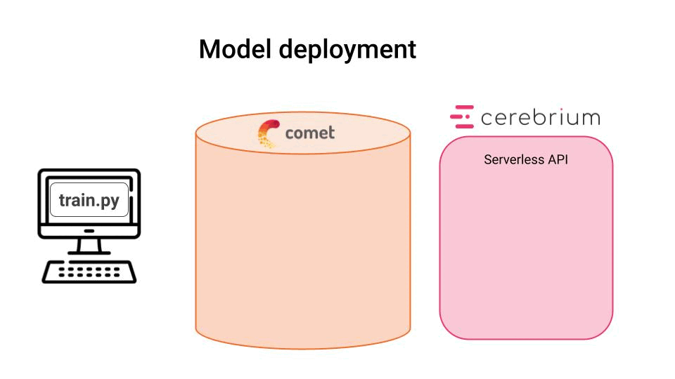
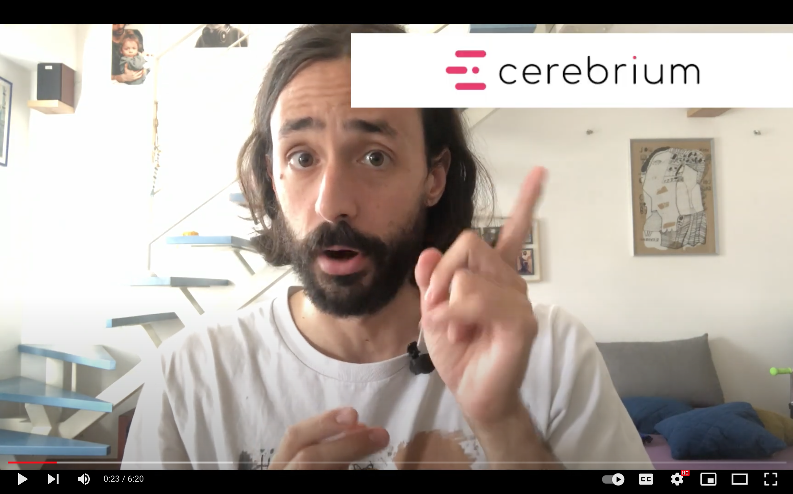

<div align="center">
    <h1>Lecture 2. Model deployment as a REST API</h1>
    <i>Serverless API with <a href="https://www.cerebrium.ai?utm_source=pau&utm_medium=partner&utm_content=github">Cerebrium</a></i>
</div>

<br />

<p align="center">
  
</p>

#### Steps
5. [Deploy the model as a Serverless REST API](#5-deploy-the-model-as-a-serverless-rest-api)
6. [Test the REST API endpoint](#6-test-the-api-endpoint)

## 5. Deploy the model as a Serverless REST API

Let's deploy our ML model as a REST API using the Serverless platform <a href="https://www.cerebrium.ai?utm_source=pau&utm_medium=partner&utm_content=github">Cerebrium</a>.

Forget about Docker, IAM roles, and EC2 instances. Serverless ML is about focusing on what differentiates your ML product, not setting up and mantaining infrastructure.

<div align="center">
    <a href="https://www.cerebrium.ai?utm_source=pau&utm_medium=partner&utm_content=github">
    <p>Click here to sign up for FREE and get your API key</p>
    </a>
</div>

<div align="center">
  <a href="https://www.youtube.com/watch?v=oxUxlJ7xdCI">
    
  </a>
</div>

Your REST API endpoint needs to preload the ML model from the CometML Model Registry. For that, you need to set the following secrets on your Cerebrium Dashboard:
- `COMET_ML_WORKSPACE`
- `COMET_ML_API_KEY`
- `COMET_ML_MODEL_NAME`

Then run
```
$ make deploy
```

## 6. Test the REST API endpoint

[PENDING VIDEO 🎬]
```
$ make test-endpoint
```

### [➡️ Go to the next lecture](../lectures/03_continuous_deployment_with_webhooks.md)
